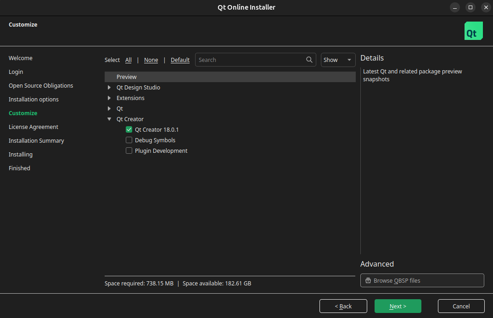
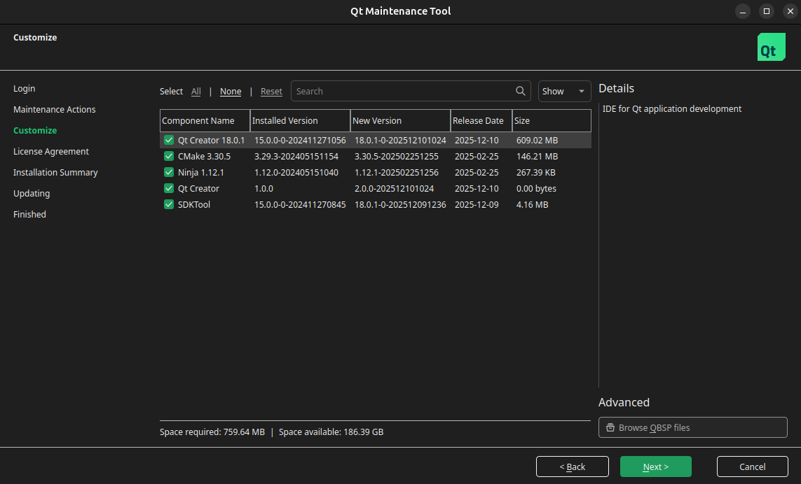

import { Aside, Steps, Tabs, TabItem } from '@astrojs/starlight/components';

The MRS SDK for Qt leverages Qt Creator <a href="https://doc.qt.io/qtcreator/creator-preferences-kits.html" target="_blank">kits</a> to cross-compile projects for various MRS products.

<Aside type="tip">

Qt Creator kits can be difficult to understand at first. If you have never worked with kits before, it is recommended to read Qt's documentation before diving in blindly.

Here are some of the most relevant pages:

- [Managing Qt versions](https://doc.qt.io/qtcreator/creator-project-qmake.html)
- [Managing registered compilers](https://doc.qt.io/qtcreator/creator-preferences-kits-compilers.html)
- [Manage kits](https://doc.qt.io/qtcreator/creator-preferences-kits.html)
- [Configuring projects](https://doc.qt.io/qtcreator/creator-configuring-projects.html)

</Aside>

## Install Qt Creator

If you have never installed Qt before, use the **Qt Online Installer** steps. If you have installed Qt before, but didn't install Qt Creator or want to update it, use the **Qt Maintenance Tool** steps.

<Tabs>
  <TabItem label="Qt Online Installer">
    **NOTE:** these steps are based on version `4.10.0` of the Qt Online Installer.

    <Steps>

    1. Create a new Qt account: https://login.qt.io/register
    2. Download the Qt Online Installer from here: https://login.qt.io/register
        - If you are using the standard MRS VM, use the `Linux x64` installer
    3. Run the installer (make it executable if necessary). Log in with your Qt credentials and accept the licenses.
    4. Choose a directory to install Qt. The default of `$HOME/Qt` is fine, or you can choose a different location.
    5. You will be presented with a list of components available to be installed. Choose Qt Creator:

        

    6. When you reach the "You are installing" screen, you should see only **Maintenance Tool** and **Qt Creator**.
    7. Click **Install** to finish the installation.

    </Steps>
  </TabItem>
  <TabItem label="Qt Maintenance Tool">
    **NOTE:** these steps are based on version `4.10.0` of the Qt Maintenance Tool.

    <Steps>

    1. Run the Qt Maintenance Tool. It is located at the top level of your existing Qt installation.
    2. Log in with your Qt credentials, then select **Update components** as the maintenance action.
    3. You will be presented with a list of components available to install/update. Choose Qt Creator, CMake, Ninja, and SDKTool. Make sure Qt Design Studio is unavailable or deselected; you do not need it for developing with the MRS Qt SDK.

        

    4. Click **Update** to finish the installation.

    </Steps>
  </TabItem>
</Tabs>

## Which kits do I need?

{/* TODO(#44): update this when NeuralPlex Yocto kit is integrated */}

Most users will not need to set up all of the possible SDK kits. For example, if you have only NeuralPlex devices, you will only need 1 of the 5 kits to work on your projects.

The following table summarizes which kits you'll need:

| Product | Kits Required |
| --- | --- |
| NeuralPlex | `desktop-qt6` |
| MConn | `mconn-yocto`, `mconn-buildroot`, `desktop-qt5` |
| FUSION | `fusion-buildroot`, `desktop-qt5` |

**NOTE:** any contributors to the [SDK project](https://github.com/mrs-electronics-inc/mrs-sdk-qt) will need to set up all kits in order to have full testing capabilities.

## Configure Kits

<Aside>
Make sure you [install Qt Creator](#install-qt-creator) before trying to configure any kits.
</Aside>

<Tabs syncKey="buildtool">
    <TabItem label="CMake">
        The SDK exports a few helper scripts under `lib/cmake/mrs-sdk-qt/toolchains` for bootstrapping CMake with the right Qt version:

        | File | Qt version | Target OS identifier |
        | --- | --- | --- |
        | `qt5-buildroot.cmake` | Buildroot Qt 5.9.1 | `buildroot` |
        | `qt5-yocto.cmake` | Yocto Qt 5.12.9 | `yocto` |
        | `qt5-desktop.cmake` | Desktop Qt 5.15 | `desktop` |
        | `qt6-desktop.cmake` | Desktop Qt 6.8 | `desktop` |

        Each helper sets cache variables used in `lib/cmake/mrs-sdk-qt/config.cmake` to compute a consistent kit identity. When creating SDK kits, you'll pass the location of this helper with something like `-DCMAKE_TOOLCHAIN_FILE=lib/cmake/mrs-sdk-qt/toolchains/qt5-yocto.cmake`.
    </TabItem>
    <TabItem label="QMake">
        The SDK exports a few helper scripts under `lib/qmake/mrs-sdk-qt/toolchains` for bootstrapping QMake with the right Qt version:

        | File | Qt version | Target OS identifier |
        | --- | --- | --- |
        | `qt5-buildroot.pri` | Buildroot Qt 5.9.1 | `buildroot` |
        | `qt5-yocto.pri` | Yocto Qt 5.12.9 | `yocto` |
        | `qt5-desktop.pri` | Desktop Qt 5.15 | `desktop` |
        | `qt6-desktop.pri` | Desktop Qt 6.8 | `desktop` |

        Each helper sets variables used in `lib/qmake/mrs-sdk-qt/config.pri` to compute a consistent kit identity. When creating SDK kits, you'll pass the location of this helper with something like `-DQMAKE_TOOLCHAIN_FILE=lib/qmake/mrs-sdk-qt/toolchains/qt5-yocto.pri`.
    </TabItem>
</Tabs>

In addition to configuring the helper script to use, you'll have to tell the kit which MRS product it targets.

### MConn Yocto (Qt5)

### MConn Buildroot (Qt5)

### FUSION Buildroot (Qt5)

### Desktop Qt6

### Desktop Qt5

