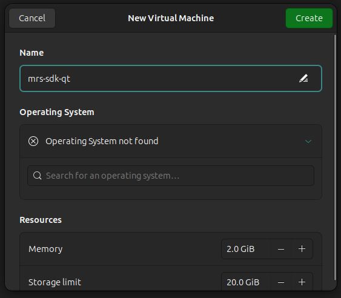

import { Aside, Steps, Tabs, TabItem } from '@astrojs/starlight/components';

The MRS SDK Qt project provides a pre-built Ubuntu 24.04 LTS Desktop virtual machine image with Qt Creator and pre-configured build kits. This guide walks you through obtaining, importing, and using the VM.

## Quick Start

<Steps>

1. [**Install**](#install-virtualization-software) virtualization software for your host OS
2. [**Obtain**](#obtaining-the-vm-image) the VMDK image (download or build locally)
3. [**Import**](#import-the-vm) it into your virtualization platform
4. **Launch** the VM and start developing with Qt Creator

</Steps>

## Image Contents

The VM includes:

- Ubuntu 24.04 LTS Desktop (minimal)
- Qt Creator IDE
- Build tools (gcc, g++, make, cmake, ninja, git)
- MRS Qt SDK pre-cloned at `~/repos/mrs-sdk-qt/`
- Automatic provisioning script:
  - Installs Qt 5.15.0 LTS and Qt 6.8.0 LTS development kits with all modules

## Install Virtualization Software

Here are our **recommended platforms** depending on your host operating system:

| Host OS | Virtualization     |
| ------- | ------------------ |
| Windows | VirtualBox, VMWare |
| Linux   | virt-manager       |

<Tabs>
   <TabItem label="VirtualBox">

1.  Download the VirtualBox platform: https://www.virtualbox.org/wiki/Downloads
2.  Installation instructions: https://www.virtualbox.org/manual/topics/installation.html

   </TabItem>
   <TabItem label="VMware">

You will have to create a free Broadcom account before you can download VMware.

1.  Create Broadcom account: https://profile.broadcom.com/web/registration
2.  Download VMware Workstation Pro: https://support.broadcom.com/group/ecx/free-downloads

   </TabItem>
   <TabItem label="virt-manager">

**NOTE:** `virt-manager` is only available for Linux users.

You can install it via your native package manager: https://virt-manager.org/

   </TabItem>
   <TabItem label="GNOME Boxes">

   <Aside type="caution">
   GNOME Boxes is easily installed alongside the GNOME desktop environment in Ubuntu, and it is commonly used for basic VM setups in many Linux distros.

However, we **DO NOT** recommend using it for the MRS SDK Qt VM. There are a few [known issues](#known-issues) that we have encountered which do not occur on other virtualization platforms.

   </Aside>

**NOTE:** GNOME Boxes is only available for Linux users.

Installation directions are here: https://snapcraft.io/gnome-boxes

   </TabItem>
</Tabs>

## Obtain the VM Image

### Option 1: Download Pre-built Image

Pre-built VM images are available for download:

1. Visit the <a href="https://mrselectronics-my.sharepoint.com/:f:/g/personal/addison_emig_mrs-electronics_com/EmT5AxglIxBJnDWp7DWMYTgBqBoZhU_oodHmsWTj_M0EEQ?e=SBnOGw" target="_blank">MRS SDK Qt VM Images OneDrive folder</a>
2. Download the latest `mrs-sdk-qt.vmdk` file
3. Follow the [import instructions](#import-the-vm) below

### Option 2: Build Locally

To build the VM image on your machine:

**Prerequisites:**

- [Docker](https://docs.docker.com/get-docker/) with Docker Compose
- KVM access (optional but recommended for faster builds)
  {/_ The VM disk by default is 60GB. The 80GB number has a safe buffer. _/}
- 80GB free disk space
- 6+ GB available RAM

**Build steps:**

<Tabs>
   <TabItem label="bash">

```bash
cd vm && ./build-vm.sh
```

   </TabItem>
   <TabItem label="just">

```bash
just vm-build
```

   </TabItem>
</Tabs>

The VMDK file will be created in the `vm/output/` directory.

More information is available in the [VM builder reference](https://github.com/mrs-electronics-inc/mrs-sdk-qt/blob/main/vm/BUILD.md).

## Import the VM

Import the VMDK file using your virtualization platform (VirtualBox, VMware, etc.):

1. Open your virtualization software
2. Import the `mrs-sdk-qt.vmdk` file
3. Configure settings (recommended: 6GB RAM, 2 CPUs, 60GB disk)
4. Start the VM

## First Boot

1. Log in with the default user credentials
   - **Username:** `ubuntu`
   - **Password:** `ubuntu`
2. **Security recommendation:** change the password on first login:

   ```bash
   passwd
   ```

3. Run the provisioning script to install all necessary Qt toolchains:

   ```bash
   ~/provision.sh
   ```

## Using the VM

The MRS SDK Qt repository is pre-cloned at `~/repos/mrs-sdk-qt/`. You can start developing immediately without needing to clone it.

### Starting Qt Creator

Select Qt Creator from the application menu or open a terminal and run:

```bash
qtcreator &
```

### Creating a New Project

1. Launch Qt Creator
2. **File** > **New Project** > Select your desired project type
3. Qt Creator will display available build kits
4. Choose your target kit and proceed

### Included Build Kits

- **Desktop Qt 5**
- **Desktop Qt 6**

### System Tools

The VM includes common development tools:

- GCC compiler and build-essential toolkit
- CMake and Ninja build systems
- Git version control
- SSH client/server
- Curl and wget

## Customization

### Increasing VM Resources

If you need more processing power:

1. **Stop the VM**
2. In your virtualization platform's settings:
   - Increase allocated RAM
   - Increase CPU cores
   - Increase disk size (may require filesystem expansion)
3. **Restart the VM**

### Installing Additional Software

Use the standard Ubuntu package manager:

```bash
sudo apt-get update
sudo apt-get install <package-name>
```

## Snapshots and Backups

Create VM snapshots before making significant changes using your virtualization platform's snapshot feature.

## Troubleshooting

### Qt Creator Won't Start

1. Verify installation:

   ```bash
   which qtcreator
   ```

2. Try launching with verbose output:

   ```bash
   qtcreator -d
   ```

3. Check system logs:
   ```bash
   journalctl -e
   ```

### Slow Performance

- Ensure VM has adequate RAM allocated (6GB recommended)
- Check host system resource availability
- Disable 3D acceleration if causing issues

### Network Issues

- Verify networking is enabled in VM settings
- Check network adapter status: `ip link show`
- Test connectivity: `ping google.com`

### Low Disk Space

Check available space:

```bash
df -h
```

If running low, you can clean up apt cache:

```bash
sudo apt-get clean
sudo apt-get autoclean
```

## Known Issues

<details>
<summary>GNOME Boxes</summary>

#### RTC Configuration

Boxes is optimized for Windows VMs, which expect the RTC (Real Time Clock) from the host to use the local time, not the UTC time. However, Ubuntu/Linux VMs typically need the RTC to be in UTC time. This is not configurable from the VM; it is determined by the hypervisor software before the VM even boots.

The MRS SDK VM is configured to sync its hardware clock with the host's UTC clock. So, with the default configuration, the VM will have an incorrect system time, which can cause issues with:

- Package manager operations (`apt`)
- SSL/TLS certificate validation
- Build timestamps and caching

To enable proper RTC in Boxes, you must edit the VM's `libvirt` configuration:

1. Right-click the VM in **GNOME Boxes** > **Preferences** > **Resources** tab
2. Click **Edit Configuration** (bottom of the dialog)
3. Locate the `<clock>` tag and modify it to look like this:

   ```xml
   <clock offset="utc">
   ...
   </clock>
   ```

4. Click **Save** to apply the changes.
5. **Restart** the VM. After reboot, the system time will automatically sync with your host system's UTC clock.

#### Operating System Auto-Detection

When you go through the process of creating a new VM in GNOME Boxes, you will be presented with a screen like this:



The **Operating System** selector is intended to streamline the process of configuring a new VM. However, the Ubuntu configurations in Boxes have been found to apply certain settings that will **break network connectivity** in the MRS SDK VM.

So, **DO NOT** select an operating system or allow auto-detection; leave the input as "not found".

#### "Failed to Start" Error

Gnome Boxes will often show an error “Failed to start...”, but this can be safely ignored. Wait a few minutes and the VM will start without issues.

</details>

## Getting Help

- **Documentation:** https://qt.mrs-electronics.dev
- **Issues:** [GitHub Issues](https://github.com/mrs-electronics-inc/mrs-sdk-qt/issues)
- **Discussions:** [GitHub Discussions](https://github.com/mrs-electronics-inc/mrs-sdk-qt/discussions)
- **Contact:** info@mrs-electronics.com
